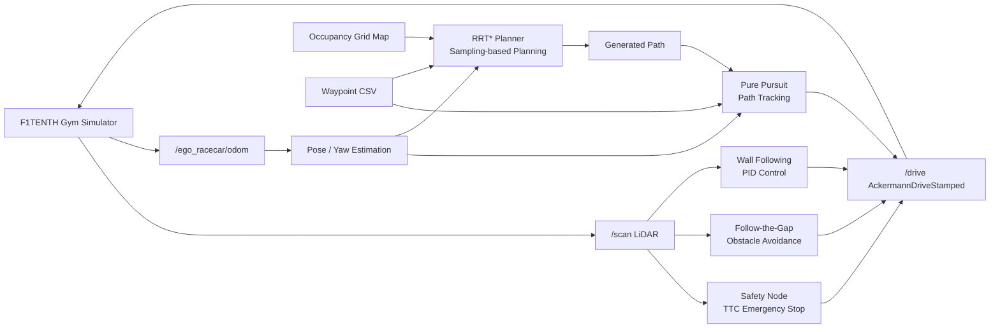
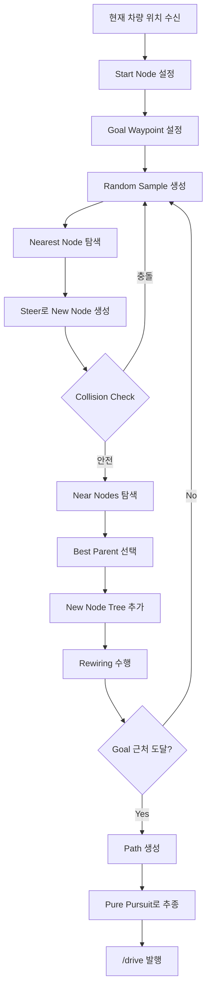
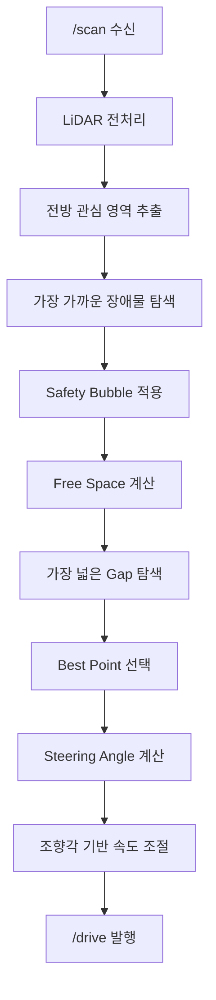
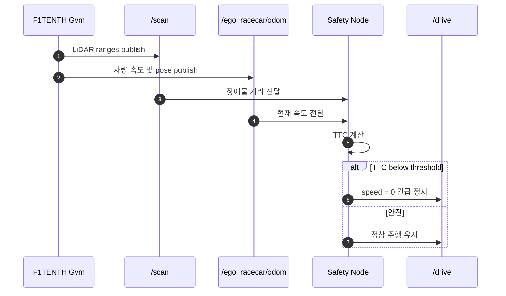
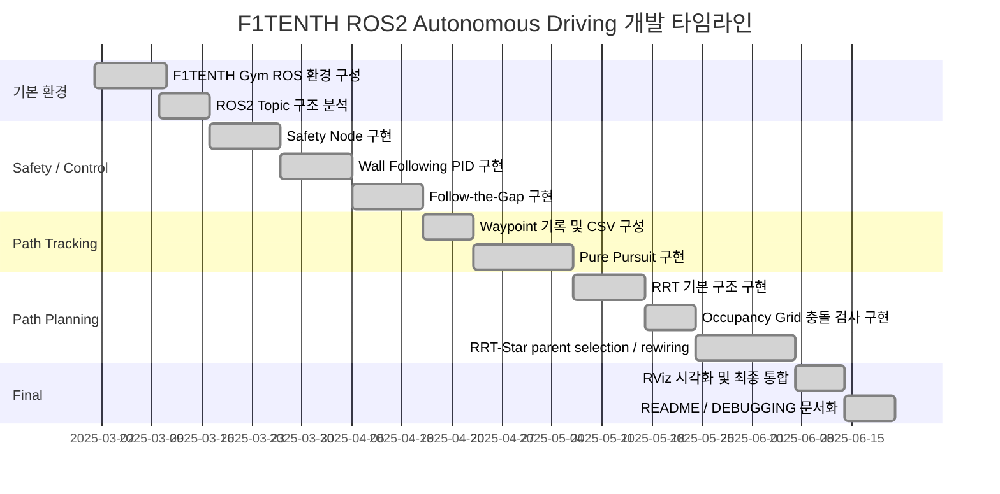

# F1TENTH ROS2 Autonomous Driving

<p align="center">
  <b>ROS2 기반 F1TENTH 자율주행 차량 · LiDAR 인지 · RRT* 경로계획 · Pure Pursuit 제어</b><br>
  ROS 2 Humble · F1TENTH Gym · Python · LiDAR · Odometry · RRT* · Pure Pursuit · Ackermann Steering
</p>

<p align="center">
  
  
  
  
  
  
</p>

<p align="center">
  <a href="#0-프로젝트-한-줄-요약">요약</a> ·
  <a href="#3-주요-기능">주요 기능</a> ·
  <a href="#4-시스템-설계">시스템 설계</a> ·
  <a href="#5-소스-코드-구성">소스 코드</a> ·
  <a href="#8-운영체제-환경">운영체제 환경</a> ·
  <a href="#9-사용한-장비-및-시뮬레이션-환경">장비</a> ·
  <a href="#10-의존성-requirements">의존성</a> ·
  <a href="#11-실행-순서-launch-순서">실행 순서</a> ·
  <a href="#14-디버깅-및-설계-개선-요약">디버깅</a>
</p>

---

## 0. 프로젝트 한 줄 요약

**F1TENTH ROS2 Autonomous Driving**은 ROS2 기반 F1TENTH Gym 시뮬레이션 환경에서 **LiDAR/Odometry 데이터를 직접 처리**하여, 자율주행 차량의 **인지 → 판단 → 경로 계획 → 경로 추종 → 차량 제어** 파이프라인을 직접 구현한 프로젝트입니다.

```text
F1TENTH Gym 시뮬레이션 실행
→ /scan LiDAR 데이터 수신
→ 장애물 거리 및 충돌 위험도 계산
→ Safety Node / Follow-the-Gap / Wall Following 수행
→ /ego_racecar/odom 기반 차량 위치 및 yaw 추정
→ Waypoint 또는 목표 지점 선택
→ Occupancy Grid 기반 충돌 검사
→ RRT* 기반 경로 계획
→ Pure Pursuit 기반 경로 추종
→ /drive AckermannDriveStamped 발행
→ 차량 조향 및 속도 제어
```

---

## 1. 프로젝트 개요

F1TENTH는 1/10 스케일 자율주행 차량 플랫폼을 기반으로 자율주행 알고리즘을 실습하고 검증할 수 있는 환경입니다.
본 프로젝트에서는 단순히 시뮬레이터를 실행하는 데서 끝나지 않고, 자율주행 차량이 주행하기 위해 필요한 핵심 알고리즘을 ROS2 Python 노드로 직접 구현하는 것을 목표로 했습니다.

| 항목     | 내용                                                        |
| ------ | --------------------------------------------------------- |
| 프로젝트명  | F1TENTH ROS2 Autonomous Driving                           |
| 개발 기간  | 2025.03 ~ 2025.06                                         |
| 개발 인원  | 1명                                                        |
| 주요 분야  | Mobile Robot, Autonomous Driving, Path Planning / Control |
| 운영체제   | Ubuntu 22.04 LTS                                          |
| ROS 버전 | ROS2 Humble                                               |
| 개발 언어  | Python                                                    |
| 시뮬레이션  | F1TENTH Gym / F1TENTH Gym ROS                             |
| 시각화    | RViz                                                      |
| 주요 센서  | 2D LiDAR, Odometry                                        |
| 제어 방식  | AckermannDriveStamped 기반 조향/속도 제어                         |

---

## 2. 개발 동기

### 2.1 단순 주행 예제의 한계

기본적인 F1TENTH 예제는 차량을 움직이거나 특정 알고리즘을 개별적으로 실행하는 데 초점이 맞춰져 있습니다. 하지만 실제 자율주행 차량은 단일 알고리즘만으로 안정적으로 동작하지 않습니다.

| 단순 구현 방식       | 한계                            |
| -------------- | ----------------------------- |
| 고정 속도 주행       | 장애물이나 코너 상황에 대응하기 어려움         |
| 단순 거리 기반 회피    | 차량 폭과 조향 한계를 반영하지 못함          |
| Waypoint만 추종   | 갑작스러운 장애물에 취약함                |
| 중심점 기준 충돌 검사   | 실제 차량 body 충돌 가능성을 반영하지 못함    |
| 경로계획과 제어 분리 부족 | 생성된 경로가 차량이 실제로 따라가기 어려울 수 있음 |

### 2.2 본 프로젝트의 접근

본 프로젝트에서는 Nav2 전체 내비게이션 스택이나 강화학습 policy를 사용하지 않고, 자율주행의 핵심 알고리즘을 직접 구현했습니다.

```text
1. LiDAR로 주변 장애물을 인식한다.
2. TTC 기반으로 충돌 위험을 판단한다.
3. 가까운 장애물 주변에는 Safety Bubble을 적용한다.
4. Waypoint와 목표 지점을 기준으로 경로를 생성한다.
5. Occupancy Grid로 주행 가능 영역과 장애물 영역을 구분한다.
6. RRT*로 충돌 없는 경로를 계획한다.
7. Pure Pursuit로 차량이 추종할 lookahead point를 선택한다.
8. AckermannDriveStamped 메시지로 조향각과 속도를 제어한다.
```

---

## 3. 주요 기능

### 3.1 Safety Node: TTC 기반 자동 긴급 정지

Safety Node는 LiDAR와 Odometry를 이용해 차량이 장애물과 충돌할 가능성을 계산하고, 위험 상황에서 자동으로 차량을 정지시키는 기능입니다.

| 기능          | 설명                                   |
| ----------- | ------------------------------------ |
| LiDAR 거리 수신 | `/scan` 토픽에서 2D LiDAR 거리 데이터 수신      |
| 차량 속도 수신    | `/ego_racecar/odom`에서 현재 차량 속도 계산    |
| TTC 계산      | 장애물 거리와 차량 속도를 이용해 충돌 예상 시간 계산       |
| 긴급 정지       | TTC가 임계값 이하일 경우 `/drive`로 speed 0 발행 |
| 구역별 판단      | 전방/측면 위험도를 다르게 판단하여 오작동 감소           |

TTC 계산 개념:

```text
TTC = obstacle_distance / relative_velocity
```

충돌 예상 시간이 짧아질수록 위험도가 높다고 판단하고, 일정 임계값 이하에서는 즉시 정지합니다.

---

### 3.2 Wall Following: PID 기반 벽 추종

Wall Following은 LiDAR의 특정 각도 거리값을 이용해 차량이 벽과 일정 거리를 유지하며 주행하도록 하는 기능입니다.

| 단계       | 설명                         |
| -------- | -------------------------- |
| 거리 측정    | LiDAR 35도, 90도 방향 거리 측정    |
| 벽 각도 계산  | 두 거리값을 이용해 벽과 차량 사이의 각도 계산 |
| 거리 오차 계산 | 목표 벽 거리와 현재 예측 거리 차이 계산    |
| PID 제어   | P, I, D 제어로 조향각 계산         |
| 속도 조절    | 조향각이 클수록 속도를 낮춰 안정성 확보     |

동작 흐름:

```text
LiDAR 35도 / 90도 거리 측정
→ 벽과 차량 사이 각도 alpha 계산
→ 미래 위치 기준 벽과의 예상 거리 계산
→ 목표 거리와의 error 계산
→ PID 제어로 steering angle 계산
→ 조향각 크기에 따라 속도 조절
```

---

### 3.3 Follow-the-Gap: LiDAR 기반 장애물 회피

Follow-the-Gap은 LiDAR 전방 영역에서 주행 가능한 빈 공간을 찾고, 가장 안전한 방향으로 차량을 조향하는 장애물 회피 알고리즘입니다.

| 기능            | 설명                          |
| ------------- | --------------------------- |
| LiDAR 전처리     | NaN, inf, 과도한 거리값 보정        |
| 관심 영역 추출      | 차량 전방 주행에 필요한 각도 영역만 사용     |
| 가장 가까운 장애물 탐색 | 충돌 위험이 높은 장애물 index 탐색      |
| Safety Bubble | 장애물 주변 일정 범위를 위험 영역으로 제거    |
| Gap 탐색        | 남은 free space 중 가장 넓은 구간 탐색 |
| Best Point 선택 | gap 중앙 또는 가장 안전한 지점으로 조향    |

동작 흐름:

```text
LiDAR ranges 수신
→ 전방 관심 영역 crop
→ NaN / inf / 과도한 거리값 보정
→ 가장 가까운 장애물 탐색
→ Safety Bubble 적용
→ 가장 넓은 gap 탐색
→ gap 중앙 방향으로 조향
```

초기에는 단순히 가장 먼 거리 방향으로 주행했지만, 이 방식은 차량 폭과 충돌 가능성을 고려하지 못했습니다.
이를 개선하기 위해 장애물 주변에 Safety Bubble을 적용하여 실제 차량이 통과하기 어려운 영역을 제거했습니다.

---

### 3.4 Pure Pursuit: Waypoint 기반 경로 추종

Pure Pursuit는 차량의 현재 위치에서 일정 거리 앞의 목표점을 선택하고, 그 목표점을 향해 차량이 따라가도록 조향각을 계산하는 경로 추종 알고리즘입니다.

| 기능                 | 설명                             |
| ------------------ | ------------------------------ |
| Waypoint 로드        | CSV 파일에서 주행 경로 좌표 로드           |
| 현재 위치 계산           | Odometry로 차량의 x, y, yaw 계산     |
| Lookahead Point 선택 | 차량 전방에 있는 목표 waypoint 선택       |
| 좌표계 변환             | map 좌표의 목표점을 차량 좌표계로 변환        |
| 곡률 계산              | 목표점까지의 곡률 기반 steering angle 계산 |
| 조향 제한              | 차량의 최대 조향각 범위로 제한              |
| 속도 제어              | 조향각이 클수록 속도를 낮춤                |

동작 흐름:

```text
Odometry 수신
→ 현재 x, y, yaw 계산
→ Waypoint 중 차량 전방의 lookahead point 선택
→ 목표점을 차량 좌표계로 변환
→ 곡률 계산
→ Ackermann steering angle 계산
→ /drive 발행
```

---

### 3.5 RRT / RRT*: 샘플링 기반 경로 계획

최종 통합 패키지 `project_f1_tenth`에서는 RRT를 기반으로 경로를 생성하고, RRT*의 핵심 요소인 **cost 기반 parent selection**과 **rewiring**을 적용했습니다.

| 요소                    | 설명                                |
| --------------------- | --------------------------------- |
| Random Sampling       | 주행 가능 영역에서 임의의 node 후보 생성         |
| Nearest Search        | 기존 tree에서 sample과 가장 가까운 node 탐색  |
| Steering              | nearest node에서 일정 거리만큼 새 node 생성  |
| Collision Check       | Occupancy Grid 기반 node/edge 충돌 검사 |
| Near Node Search      | 새 node 주변의 후보 parent 탐색           |
| Cost Calculation      | start부터 node까지의 누적 비용 계산          |
| Best Parent Selection | 가장 낮은 cost를 갖는 parent 선택          |
| Rewiring              | 주변 node의 경로 비용이 줄어들 경우 parent 재연결 |
| Path Extraction       | goal 도달 시 parent를 역추적하여 path 생성   |

RRT* 동작 흐름:

```text
1. 현재 차량 위치를 start node로 설정
2. 현재 목표 waypoint를 goal node로 설정
3. 주행 가능 영역에서 random sample 생성
4. tree에서 sample과 가장 가까운 nearest node 탐색
5. steer 함수로 새 node 생성
6. Occupancy Grid 기반 collision check 수행
7. 주변 near node 탐색
8. 가장 cost가 낮은 parent 선택
9. 새 node를 tree에 추가
10. rewiring으로 주변 node의 parent 재설정
11. goal 근처 도달 시 path 생성
12. 생성된 path를 Pure Pursuit 방식으로 추종
```

---

### 3.6 Occupancy Grid 기반 충돌 검사

Occupancy Grid는 맵 정보를 grid cell 단위로 표현하여, 각 위치가 주행 가능 영역인지 장애물 영역인지 판단하는 데 사용했습니다.

초기에는 장애물 cell만 충돌 영역으로 판단했기 때문에 차량 중심점은 지나갈 수 있어도 실제 차량 body가 장애물에 닿을 수 있었습니다. 이를 해결하기 위해 장애물 주변을 확장하는 방식으로 안전 영역을 확보했습니다.

| 개선 항목                 | 설명                             |
| --------------------- | ------------------------------ |
| Obstacle Inflation    | 장애물 주변 영역을 차량 크기만큼 확장          |
| Node Collision Check  | 생성된 node가 장애물 영역에 포함되는지 검사     |
| Edge Collision Check  | 두 node 사이 직선 경로가 장애물과 충돌하는지 검사 |
| Intermediate Sampling | edge 중간 지점을 일정 간격으로 검사         |
| Safety Margin         | 차량 폭과 회전 여유를 고려한 margin 적용     |

---

## 4. 시스템 설계

### 4.1 전체 시스템 아키텍처



### 4.2 RRT* 경로계획 플로우차트



### 4.3 장애물 회피 플로우차트



### 4.4 Safety Node 시퀀스



---

## 5. 소스 코드 구성

```text
sim_ws/
├── README.md
├── DEBUGGING.md
├── run_ros2.sh
├── log/
│   └── waypoint.csv
└── src/
    ├── f1tenth_gym_ros/
    │   ├── launch/
    │   │   └── gym_bridge_launch.py
    │   ├── maps/
    │   │   ├── levine.yaml
    │   │   └── levine.png
    │   └── config/
    │       └── sim.yaml
    │
    ├── safety_node/
    │   └── safety_node/
    │       └── safety_node.py
    │
    ├── wall_follow/
    │   └── wall_follow/
    │       └── wall_follow.py
    │
    ├── follow_gap/
    │   └── follow_gap/
    │       └── follow_gap.py
    │
    ├── pure_pursuit/
    │   └── pure_pursuit/
    │       └── pure_pursuit.py
    │
    ├── rrt_node/
    │   └── rrt_node/
    │       └── rrt_node.py
    │
    └── project_f1_tenth/
        └── project_f1_tenth/
            ├── project_f1_tenth.py
            ├── make_waypoint.py
            └── visualizer.py
```

---

## 6. 주요 파일 설명

| 파일                                                          | 설명                                            |
| ----------------------------------------------------------- | --------------------------------------------- |
| `src/f1tenth_gym_ros/launch/gym_bridge_launch.py`           | F1TENTH Gym ROS 시뮬레이션, map server, bridge 실행  |
| `src/safety_node/safety_node/safety_node.py`                | TTC 기반 자동 긴급 정지 구현                            |
| `src/wall_follow/wall_follow/wall_follow.py`                | PID 기반 Wall Following 구현                      |
| `src/follow_gap/follow_gap/follow_gap.py`                   | Follow-the-Gap 기반 장애물 회피 구현                   |
| `src/pure_pursuit/pure_pursuit/pure_pursuit.py`             | Waypoint 기반 Pure Pursuit 경로 추종 구현             |
| `src/rrt_node/rrt_node/rrt_node.py`                         | RRT 경로 계획 기본 구조 구현                            |
| `src/project_f1_tenth/project_f1_tenth/project_f1_tenth.py` | 최종 통합 RRT* / Occupancy Grid / Pure Pursuit 제어 |
| `src/project_f1_tenth/project_f1_tenth/make_waypoint.py`    | 주행 waypoint 기록 및 저장                           |
| `src/project_f1_tenth/project_f1_tenth/visualizer.py`       | Waypoint 및 경로 시각화                             |
| `log/waypoint.csv`                                          | Pure Pursuit 및 RRT* 목표 경로용 waypoint 데이터       |
| `run_ros2.sh`                                               | ROS2 실행 보조 스크립트                               |

---

## 7. ROS2 인터페이스

### 7.1 주요 Topic

| Topic               | Message Type                           | 설명                  |
| ------------------- | -------------------------------------- | ------------------- |
| `/scan`             | `sensor_msgs/LaserScan`                | 2D LiDAR 거리 데이터     |
| `/ego_racecar/odom` | `nav_msgs/Odometry`                    | 차량 위치, 자세, 속도       |
| `/drive`            | `ackermann_msgs/AckermannDriveStamped` | 차량 조향각 및 속도 명령      |
| `/map`              | `nav_msgs/OccupancyGrid`               | 맵 정보                |
| `/rrt/map`          | `nav_msgs/OccupancyGrid`               | RRT용 Occupancy Grid |
| `/rrt/tree_markers` | `visualization_msgs/MarkerArray`       | RRT tree 시각화        |
| `/waypoints_marker` | `visualization_msgs/Marker`            | Waypoint 시각화        |

### 7.2 제어 메시지 구조

```text
AckermannDriveStamped
├── drive.speed
└── drive.steering_angle
```

| 필드               | 설명            |
| ---------------- | ------------- |
| `speed`          | 차량 주행 속도      |
| `steering_angle` | Ackermann 조향각 |

---

## 8. 운영체제 환경

| 구분                | 기준                            |
| ----------------- | ----------------------------- |
| OS                | Ubuntu 22.04 LTS              |
| ROS               | ROS2 Humble                   |
| Python            | Python 3.10                   |
| Simulator         | F1TENTH Gym / F1TENTH Gym ROS |
| Visualization     | RViz                          |
| Build Tool        | colcon                        |
| Main Language     | Python                        |
| Control Interface | AckermannDriveStamped         |

---

## 9. 사용한 장비 및 시뮬레이션 환경

### 9.1 개발 환경

| 구분     | 내용                    |
| ------ | --------------------- |
| 개발 PC  | Ubuntu 22.04 기반 로컬 PC |
| ROS 환경 | ROS2 Humble           |
| 시뮬레이터  | F1TENTH Gym           |
| 시각화    | RViz                  |
| 개발 언어  | Python                |

### 9.2 시뮬레이션 구성

| 구성 요소          | 설명                |
| -------------- | ----------------- |
| Ego Racecar    | 제어 대상 F1TENTH 차량  |
| 2D LiDAR       | 주변 장애물 거리 측정      |
| Odometry       | 차량 위치, 자세, 속도 추정  |
| Levine Map     | F1TENTH 주행 맵      |
| Waypoint CSV   | 경로 추종 및 목표점 설정    |
| Occupancy Grid | 충돌 검사 및 경로 계획에 사용 |

---

## 10. 의존성 requirements

### 10.1 ROS2 / 시스템 패키지

```bash
sudo apt update
sudo apt install -y \
  ros-humble-desktop \
  ros-humble-ackermann-msgs \
  ros-humble-nav2-map-server \
  ros-humble-nav2-lifecycle-manager \
  ros-humble-xacro \
  ros-humble-robot-state-publisher \
  ros-humble-teleop-twist-keyboard \
  python3-colcon-common-extensions \
  python3-pip
```

### 10.2 Python 패키지

```bash
python3 -m pip install \
  numpy \
  scipy \
  pillow \
  pyyaml \
  transforms3d
```

### 10.3 requirements.txt 예시

```txt
numpy
scipy
pillow
pyyaml
transforms3d
```

---

## 11. 실행 순서 launch 순서

### 11.1 ROS2 환경 설정

```bash
source /opt/ros/humble/setup.bash
```

### 11.2 워크스페이스 빌드

```bash
cd ~/sim_ws
colcon build --symlink-install
source install/setup.bash
```

### 11.3 F1TENTH Gym 시뮬레이터 실행

```bash
ros2 launch f1tenth_gym_ros gym_bridge_launch.py
```

### 11.4 Safety Node 실행

```bash
source ~/sim_ws/install/setup.bash
ros2 run safety_node safety_node
```

### 11.5 Wall Following 실행

```bash
source ~/sim_ws/install/setup.bash
ros2 run wall_follow wall_follow
```

### 11.6 Follow-the-Gap 실행

```bash
source ~/sim_ws/install/setup.bash
ros2 run follow_gap follow_gap
```

### 11.7 Pure Pursuit 실행

```bash
source ~/sim_ws/install/setup.bash
ros2 run pure_pursuit pure_pursuit
```

### 11.8 RRT 기본 노드 실행

```bash
source ~/sim_ws/install/setup.bash
ros2 run rrt_node rrt_node
```

### 11.9 최종 통합 RRT* 노드 실행

```bash
source ~/sim_ws/install/setup.bash
ros2 run project_f1_tenth project_f1_tenth
```

### 11.10 Waypoint 생성 및 시각화

```bash
source ~/sim_ws/install/setup.bash
ros2 run project_f1_tenth make_waypoint
ros2 run project_f1_tenth visualizer
```

---

## 12. 실행 전 경로 확인

현재 코드에는 개발 PC 기준 절대경로가 포함되어 있을 수 있습니다.

```text
/home/yoon/sim_ws/log/waypoint.csv
/home/yoon/sim_ws/log/wp-2025-05-14-09-31-38.csv
~/sim_ws/src/f1tenth_gym_ros/maps/levine.yaml
```

다른 PC에서 실행할 경우 위 경로를 본인 환경에 맞게 수정해야 합니다.

향후 개선 방향:

```text
1. waypoint 파일을 data/waypoint.csv로 이동
2. 코드에서 절대경로 대신 ROS2 parameter 사용
3. config yaml로 map_path, waypoint_path 관리
4. get_package_share_directory() 기반 경로 참조
```

---

## 13. Nav2 및 강화학습 사용 여부

본 프로젝트는 **Nav2 전체 내비게이션 스택을 사용한 프로젝트가 아닙니다.**

`f1tenth_gym_ros` 실행부에서 `nav2_map_server`는 map을 publish하기 위한 용도로 사용될 수 있지만, 실제 주행 판단, 경로 계획, 경로 추종, 제어는 직접 구현한 Python ROS2 노드에서 수행했습니다.

또한 본 프로젝트는 **강화학습 기반 프로젝트가 아닙니다.**

```text
Nav2 기반 자율주행 X
강화학습 기반 policy X
직접 구현한 고전 자율주행 알고리즘 O
RRT* 기반 경로 계획 O
Pure Pursuit 기반 경로 추종 O
Ackermann 제어 O
```

---

## 14. 디버깅 및 설계 개선 요약

| 구분               | 문제                         | 원인                          | 해결                                      |
| ---------------- | -------------------------- | --------------------------- | --------------------------------------- |
| Safety Node      | 실제 충돌 위험이 낮은데 급정지          | 전체 LiDAR beam에 동일 TTC 기준 적용 | 전방/측면 구역 분리 및 임계값 튜닝                    |
| LiDAR 처리         | 장애물 방향 판단 오류               | beam index와 실제 각도 불일치       | `angle_min`, `angle_increment` 기반 각도 계산 |
| Follow Gap       | 좁은 통로를 주행 가능 영역으로 판단       | 차량 폭과 안전 반경 미고려             | Safety Bubble 적용                        |
| 회피 제어            | 조향각이 좌우로 흔들림               | LiDAR noise와 best point 급변  | smoothing 및 조향각 기반 속도 제어                |
| Wall Follow      | 벽과의 거리 유지 불안정              | PID gain 미튜닝                | P/D gain 조정 및 속도 제어                     |
| Pure Pursuit     | waypoint를 놓치거나 코너에서 이탈     | lookahead distance 부적절      | 전방 waypoint 선택 및 lookahead 튜닝           |
| Occupancy Grid   | 벽 안쪽에 node 생성              | world 좌표와 grid index 변환 오류  | origin/resolution 기반 좌표 변환              |
| Collision Check  | 장애물 근처 경로 생성               | 차량 중심점 기준 검사                | obstacle inflation 및 edge 중간점 검사        |
| RRT*             | 경로 생성 시간이 오래 걸림            | 전체 map 무작위 sampling         | goal bias 및 sampling 범위 제한              |
| RRT*             | 차량이 따라가기 어려운 경로 생성         | Ackermann 조향 제약 미반영         | heading constraint 적용                   |
| Dynamic Obstacle | 갑작스러운 장애물 대응 지연            | RRT* 재계산 시간 필요              | Safety Bubble / Emergency Stop 우선 처리    |
| RViz             | 시각화 위치 불일치                 | marker frame_id 불일치         | map/odom 기준 frame 통일                    |
| 실행 환경            | 다른 PC에서 waypoint/map 경로 오류 | 절대경로 사용                     | parameter/config 기반 개선 예정               |
| GitHub           | f1tenth_gym_ros 폴더가 비어 보임  | 내부 `.git` 포함                | 중첩 `.git` 제거                            |

---

## 15. 현재 구현 상태

| 항목                               | 상태    |
| -------------------------------- | ----- |
| F1TENTH Gym ROS 실행               | 구현 완료 |
| LiDAR `/scan` 수신                 | 구현 완료 |
| Odometry `/ego_racecar/odom` 수신  | 구현 완료 |
| Ackermann `/drive` 제어            | 구현 완료 |
| TTC 기반 Safety Node               | 구현 완료 |
| PID 기반 Wall Following            | 구현 완료 |
| Follow-the-Gap 장애물 회피            | 구현 완료 |
| Safety Bubble 적용                 | 구현 완료 |
| Waypoint CSV 기반 경로 추종            | 구현 완료 |
| Pure Pursuit 제어                  | 구현 완료 |
| Occupancy Grid 기반 충돌 검사          | 구현 완료 |
| RRT 기본 구조                        | 구현 완료 |
| RRT-Star parent selection / rewiring | 구현 완료 |
| RViz Marker 시각화                  | 구현 완료 |
| Nav2 전체 스택 미사용 구분                | 정리 완료 |
| 강화학습 미사용 구분                      | 정리 완료 |

---

## 16. 개발 타임라인



---

## 17. GitHub 업로드 전 주의사항

공개 저장소에 올리기 전 아래 항목은 제외하는 것이 좋습니다.

```text
build/
install/
log/build_*/
log/list_*/
log/latest*
__pycache__/
*.pyc
*.bag
*.db3
*.sqlite3
*.zip
```

단, 현재 코드에서 `log/waypoint.csv`를 직접 참조하고 있다면 해당 파일은 유지해야 합니다.

권장 `.gitignore` 예시:

```gitignore
build/
install/
log/build_*/
log/list_*/
log/latest*
log/COLCON_IGNORE

__pycache__/
*.pyc
*.pyo

.vscode/
.idea/
.DS_Store

*.bag
*.db3
*.sqlite3
*.zip
```

---

## 18. README 작성 항목 체크리스트

| 요구 항목          | README 반영 위치                 | 상태 |
| -------------- | ---------------------------- | -- |
| 프로젝트 개요        | `1. 프로젝트 개요`                 | 반영 |
| 개발 동기          | `2. 개발 동기`                   | 반영 |
| 주요 기능          | `3. 주요 기능`                   | 반영 |
| 시스템 설계 / 플로우차트 | `4. 시스템 설계`                  | 반영 |
| 소스 코드 설명       | `5. 소스 코드 구성`, `6. 주요 파일 설명` | 반영 |
| ROS2 인터페이스     | `7. ROS2 인터페이스`              | 반영 |
| 운영체제 환경        | `8. 운영체제 환경`                 | 반영 |
| 사용 장비 / 시뮬레이션  | `9. 사용한 장비 및 시뮬레이션 환경`       | 반영 |
| 의존성            | `10. 의존성 requirements`       | 반영 |
| 실행 순서          | `11. 실행 순서 launch 순서`        | 반영 |
| 디버깅 요약         | `14. 디버깅 및 설계 개선 요약`         | 반영 |
| 현재 구현 상태       | `15. 현재 구현 상태`               | 반영 |

---

## 19. 최종 정리

F1TENTH ROS2 Autonomous Driving 프로젝트는 ROS2 기반 F1TENTH Gym 환경에서 LiDAR와 Odometry 데이터를 직접 처리하여 자율주행 차량의 핵심 알고리즘을 구현한 프로젝트입니다.

단순히 Nav2를 실행하거나 강화학습 policy를 적용한 것이 아니라, Safety Node, Wall Following, Follow-the-Gap, Pure Pursuit, Occupancy Grid, RRT/RRT-Star를 직접 구현하면서 자율주행 차량의 전체 파이프라인을 구성했습니다.

가장 중요한 차별점은 다음과 같습니다.

```text
1. LiDAR 기반 인지와 충돌 위험 판단을 직접 구현했다.
2. Safety Bubble을 적용하여 차량 크기를 고려한 장애물 회피를 수행했다.
3. Occupancy Grid 기반 충돌 검사로 경로의 안전성을 검증했다.
4. RRT-Star 기반 parent selection과 rewiring으로 경로 품질을 개선했다.
5. Pure Pursuit와 Ackermann 제어를 연결해 실제 차량 제어 명령을 생성했다.
```

최종적으로 본 프로젝트는 자율주행 차량의 **인지, 안전 판단, 경로 계획, 경로 추종, 제어** 과정을 ROS2 기반으로 직접 구현한 자율주행 알고리즘 프로젝트로 정리할 수 있습니다.

---

# 부록 A. 전체 디버깅 및 구현 정리

## A-1. 자동 긴급 정지 알고리즘 오작동

### 증상

차량이 벽 옆을 지나가거나 코너를 통과할 때, 실제 전방 충돌 위험이 크지 않은데도 갑자기 정지하는 문제가 발생했습니다.

### 원인

초기 구현에서는 LiDAR 전체 beam 중 가장 가까운 장애물을 기준으로 TTC를 계산했습니다.
하지만 측면 벽은 차량이 평행하게 지나가는 경우 실제 충돌 위험이 낮습니다.

### 해결

LiDAR beam을 전방, 좌측, 우측 구역으로 나누고, 각 구역별로 다른 임계값을 적용했습니다.

```text
전방 영역: 충돌 위험에 민감하게 반응
좌측/우측 영역: 완화된 기준 적용
후방 또는 불필요 영역: 판단 제외
```

### 결과

불필요한 급정지가 줄어들었고, 실제 전방 충돌 위험 상황에 더 정확히 반응하게 되었습니다.

---

## A-2. LiDAR beam 각도 처리 오류

### 증상

오른쪽 장애물을 왼쪽 장애물처럼 판단하거나, 전방 장애물의 각도가 어긋나 회피 방향이 반대로 계산되는 문제가 있었습니다.

### 원인

LaserScan 메시지의 ranges index만 기준으로 각도를 판단했기 때문입니다.

### 해결

각 beam의 실제 각도를 다음과 같이 계산했습니다.

```text
angle = angle_min + index * angle_increment
```

### 결과

장애물 방향 판단이 안정화되었고, 회피 조향 방향이 실제 환경과 일치하게 되었습니다.

---

## A-3. 좁은 통로 오판 문제

### 증상

차량이 실제로 지나가기 어려운 좁은 공간을 free space로 판단했습니다.

### 원인

LiDAR 거리값만 기준으로 gap을 판단했고, 차량 폭과 안전 반경을 고려하지 않았습니다.

### 해결

가장 가까운 장애물 주변에 Safety Bubble을 적용하여 위험 영역을 제거했습니다.

```text
가장 가까운 장애물 탐색
→ 해당 index 주변 일정 범위 제거
→ 남은 free space에서 가장 넓은 gap 탐색
→ gap 중앙 방향으로 조향
```

### 결과

차량 body 기준으로 통과하기 어려운 공간을 회피할 수 있게 되었습니다.

---

## A-4. Follow-the-Gap 조향 흔들림

### 증상

장애물 회피 중 조향각이 좌우로 빠르게 바뀌며 차량이 지그재그로 움직였습니다.

### 원인

LiDAR 값이 프레임마다 조금씩 변하고, best point가 매번 급격히 바뀌었기 때문입니다.

### 해결

LiDAR ranges에 smoothing을 적용하고, 조향각 크기에 따라 속도를 조절했습니다.

```text
조향각 작음 → 속도 증가
조향각 큼 → 속도 감소
```

### 결과

장애물 회피 중 차량의 좌우 흔들림이 줄었습니다.

---

## A-5. Pure Pursuit waypoint 추종 실패

### 증상

차량이 waypoint를 정확히 따라가지 못하거나 코너에서 경로 밖으로 벗어났습니다.

### 원인

lookahead distance가 고정되어 있었고, 뒤쪽 waypoint를 목표로 선택하는 경우가 있었습니다.

### 해결

차량 좌표계 기준으로 전방에 있는 waypoint만 후보로 사용했습니다.

```text
x_vehicle_frame > 0 인 waypoint만 후보로 선택
```

또한 조향각을 최대 조향각 범위로 제한했습니다.

### 결과

코너 구간에서 경로 이탈이 줄고, waypoint 추종 안정성이 개선되었습니다.

---

## A-6. Occupancy Grid 좌표 변환 오류

### 증상

RRT-Star node가 벽 안쪽이나 장애물 영역에 생성되는 문제가 있었습니다.

### 원인

world coordinate와 grid index 사이 변환에서 map origin과 resolution 처리가 정확하지 않았습니다.

### 해결

다음 변환식을 기준으로 좌표계를 정리했습니다.

```text
grid_x = int((world_x - origin_x) / resolution)
grid_y = int((world_y - origin_y) / resolution)
```

### 결과

RRT-Star node와 edge가 실제 주행 가능 영역에 생성되도록 개선되었습니다.

---

## A-7. 장애물 근처 경로 생성 문제

### 증상

경로가 장애물과 너무 가까이 생성되어 실제 차량 body 기준으로는 충돌 가능성이 있었습니다.

### 원인

충돌 검사를 차량 중심점 기준으로만 수행했습니다.

### 해결

Occupancy Grid에 obstacle inflation을 적용하고, edge 중간 지점도 collision check에 포함했습니다.

```text
원본 obstacle cell
→ 차량 크기만큼 inflation
→ inflated obstacle도 충돌 영역으로 판단
```

### 결과

장애물과 충분한 여유를 둔 경로가 생성되었습니다.

---

## A-8. RRT* 경로 생성 시간 문제

### 증상

복잡한 구간에서 목표 지점까지 경로를 찾는 데 시간이 오래 걸렸습니다.

### 원인

전체 map 영역에서 무작위로 sample을 생성했기 때문에 불필요한 node가 많이 생성되었습니다.

### 해결

sampling 영역을 제한하고, 일정 확률로 goal point를 sample로 사용하는 goal bias를 적용했습니다.

### 결과

tree가 목표 방향으로 확장되는 비율이 증가했고, 불필요한 node 생성이 줄었습니다.

---

## A-9. Ackermann 차량이 따라가기 어려운 경로 문제

### 증상

RRT-Star path는 생성되지만 차량이 실제로 따라가기 어려운 급격한 방향 전환이 포함되는 경우가 있었습니다.

### 원인

F1TENTH 차량은 Ackermann steering 구조이기 때문에 제자리 회전이 불가능합니다. 하지만 초기 RRT*는 점과 점을 직선으로만 연결했습니다.

### 해결

parent node와 child node 사이의 heading 차이를 계산하고, 일정 각도 이상 차이가 나는 후보를 제외했습니다.

### 결과

급격한 방향 전환이 줄고, Pure Pursuit가 추종 가능한 path가 생성되었습니다.

---

## A-10. 동적 장애물 대응 속도 문제

### 증상

주행 중 갑자기 장애물이 나타났을 때 RRT* 경로 재계산만으로는 즉각 대응이 어려웠습니다.

### 원인

RRT*는 cost 계산과 rewiring을 포함하므로 단순 회피 알고리즘보다 계산량이 많습니다.

### 해결

경로 계획과 긴급 안전 제어를 분리했습니다.

```text
일반 주행: RRT-Star path + Pure Pursuit
위험 상황: Safety Bubble + Emergency Stop 우선 처리
```

### 결과

경로 계획 안정성과 실시간 안전 제어를 분리하여 전체 주행 안정성을 높였습니다.

---

## A-11. RViz 시각화 위치 불일치

### 증상

RViz에서 표시되는 RRT tree, waypoint, 차량 위치가 실제 주행 위치와 어긋나 보였습니다.

### 원인

Marker 메시지의 `frame_id`와 경로 생성 기준 좌표계가 일치하지 않았습니다.

### 해결

RRT tree, path, waypoint marker의 `frame_id`를 경로 생성 기준 좌표계와 일치시켰습니다.

### 결과

RViz 시각화 결과와 실제 차량 위치가 일치하게 되어 디버깅이 쉬워졌습니다.

---

## A-12. 실행 환경 절대경로 문제

### 증상

다른 PC에서 실행하면 waypoint 파일이나 map 파일을 찾지 못할 수 있었습니다.

### 원인

개발 중 빠른 테스트를 위해 개인 PC 기준 절대경로를 코드에 직접 작성했습니다.

### 해결 방향

향후 다음 방식으로 개선할 수 있습니다.

```text
1. ROS2 parameter로 waypoint_path, map_path 입력
2. config yaml로 경로 관리
3. package share directory 기준 파일 참조
```

---

# 부록 B. requirements.txt

```txt
numpy
scipy
pillow
pyyaml
transforms3d
```

---

# 부록 C. GitHub 업로드 기준

```text
루트 README.md에 프로젝트 개요, 주요 기능, 시스템 설계, 실행 방법, 디버깅 기록을 모두 포함했습니다.
별도 DEBUGGING.md를 유지하면 디버깅 과정을 더 길게 분리해서 관리할 수 있습니다.
```
